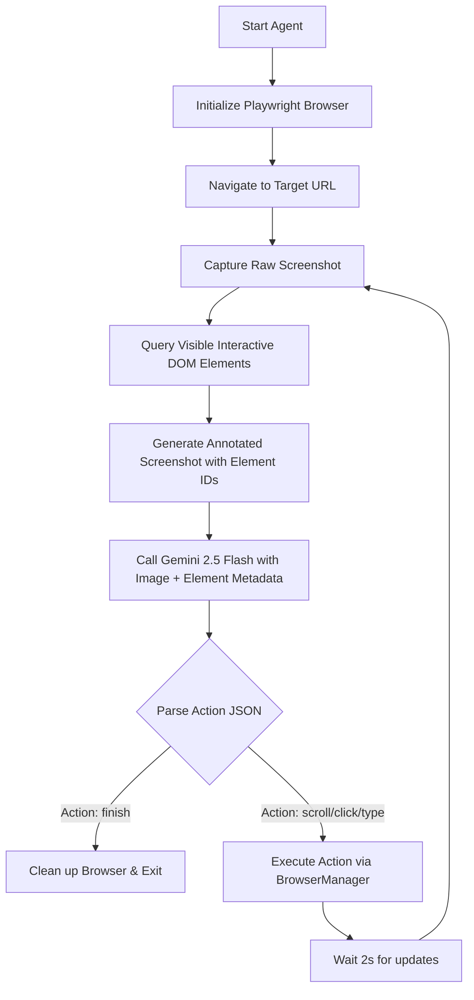

# Website Automation Agent - Architecture Document

This document describes the design decisions, component roles, and overall workflow of the Website Automation Agent.

## Core Design Decisions

1. **Language & SDK Stack**: 
   We chose **Python 3** and the new official **`google-genai`** SDK. Python has first-class support for browser automation and modern AI workflows, and `google-genai` provides seamless access to the latest Gemini 2.5 models.

2. **Browser Automation Library**: 
   We chose **Playwright** over Puppeteer because Playwright offers a native, synchronous Python API, excellent handling of modern single-page apps (like React/shadcn/ui), and superior support for viewport-accurate screenshot capture.

3. **Multimodal Reasoning (Set-of-Mark / SoM)**: 
   Rather than relying solely on raw HTML structures (which can exceed model context limits and confuse the model with boilerplate code) or raw screenshots (where the model might miss small fields), our agent uses a **Set-of-Mark (SoM)** visual prompting approach:
   - **DOM Parsing**: It runs a fast JavaScript routine to identify visible interactive elements (buttons, inputs, links).
   - **Visual Overlay**: It overlays red bounding boxes and numeric ID badges directly onto the screenshot.
   - **Coordinate Resolution**: The model only needs to return an ID (e.g., `3`) in its JSON response. The agent then resolves that ID back to the exact pixel coordinate to perform click and type operations. This makes element interaction extremely robust.

4. **Structured JSON Action Format**:
   We configure Gemini with `response_mime_type="application/json"` and instruct it to return standard schemas containing a `thought` string and an `action` specification. This guarantees that we can parse the agent's decisions reliably.

---

## Architecture Flow

The workflow is designed as an iterative loop:

---

## Component Roles

- **`config.py`**: Manages environment variables (such as API keys), browser execution settings (headless/headed), default timeouts, and output directories (`screenshots/` and log files).
- **`browser_manager.py`**: Interacts directly with Playwright. Implements the specific tools required: `open_browser`, `navigate_to_url`, `take_screenshot`, `click_on_screen`, `double_click`, `send_keys`, and `scroll`. It also runs the JS snippet to find interactive elements.
- **`utils.py`**: Implements the Pillow-based image marking routine (`annotate_screenshot`) that overlays coordinates and text labels, and houses the JS element selector string.
- **`agent.py`**: Governs the agent's lifetime loop. It orchestrates screenshot capture, annotation, Gemini prompt building, API call dispatching, JSON response sanitation, and calls back to browser tools.
- **`main.py`**: The command-line entry point. It sets up logging outputs, parses input arguments, validates config state, runs the agent, and ensures proper browser process cleanup in all termination paths.
